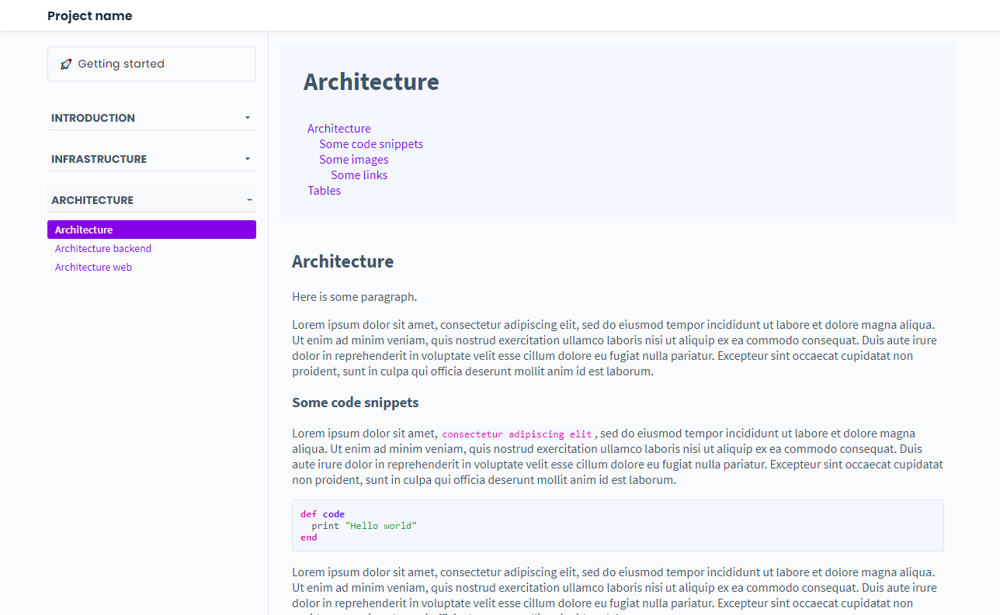

# Jekyll Theme: Alta Docs Theme

The Jekyll theme for documenting software development projects.

## Basic usage

### New Jekyll project

1. Install Jekyll

        gem install bundler jekyll

2. Create Jekyll project:

        jekyll new my-project

3. Go to the project:

        cd my-project

4. Run:

        bundle exec jekyll serve
        # OR
        bundle exec jekyll serve --host xxx.xx.xxx.xx --port 4001

### Use jekyll-theme-alta-docs

1. Change `Gemfile`

        # gem "minima", "~> 2.5" # <-- Remove or comment
        gem "jekyll-theme-alta-docs" # <--- Add

2. Run:

        $ bundle install

3. Create *_docs/* folder

4. Edit `_config.yml`:

        # Set new theme:
        theme: jekyll-theme-alta-docs

        # Register new collection "docs" from "_docs" folder:
        collections:
          docs:
            output: true
            permalink: /:collection/:name/

        # Bind your "docs" collection
        doc_collection    : docs

5. Add markdown files to the `_docs/` folder:

        # _docs/01_intro/getting_started.md
        ---
        title: Getting started  # Enter any name
        category: Intro # Enter any category. Categories are used to group docs.
        layout: doc # Important! Use doc layout
        toc: true # Optional: to display table of contents
        order: 11 # To sort the documents in the navigation
        ---

        ## Getting started

        Hello world!

6. Add `index.md` in the root directory (Home page):

        # index.md
        ---
        layout: page
        ---

        # Home page

        This is my home page

7. Run:

        bundle exec jekyll serve

### What's next?

Add more documents in *_docs* folder and see [advanced options](#advanced-options).

## Advanced options

### Common _config.yml options

        title             : "Project title"
        project_name      : "Project name" # Displayed in the navbar

### Links

Links to the repositories can be added in *_config.yml*:

        links:
          repos:
            - name  : Web app repository
              icon  : "fab fa-github" # Use fontawesome v6
              url   : https://bitbucket.org/
            - name  : Backend repository
              icon  : "fab fa-bitbucket" # Use fontawesome v6
              url   : https://bitbucket.org/
            - name  : Docs repository
              icon  : "fab fa-gitlab" # Use fontawesome v6
              url   : https://bitbucket.org/

Repositories links are displayed in website footer.

### Versioning

The documentation version is displayed in the footer.

        doc_version       : 1.0.0

## Development

To set up your environment to develop this theme, run `bundle install`.

To test theme, run: `bundle exec rake preview` or `bundle exec rake preview host=xxx.xx.xxx.xx`

## License

The theme is available as open source under the terms of the [MIT License](https://opensource.org/licenses/MIT).
